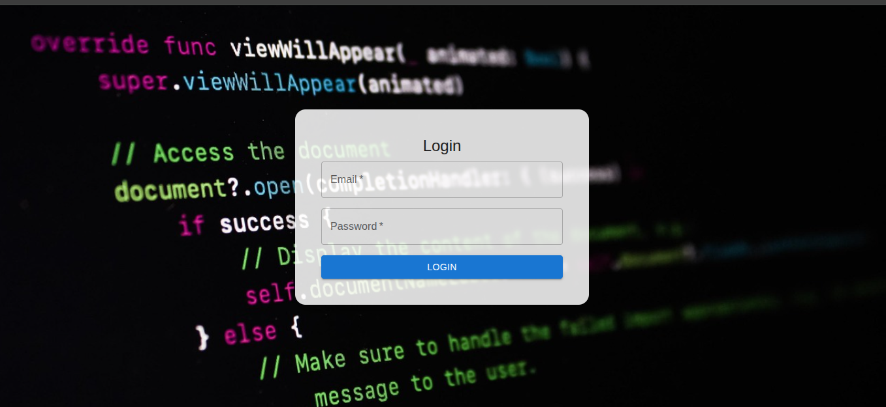
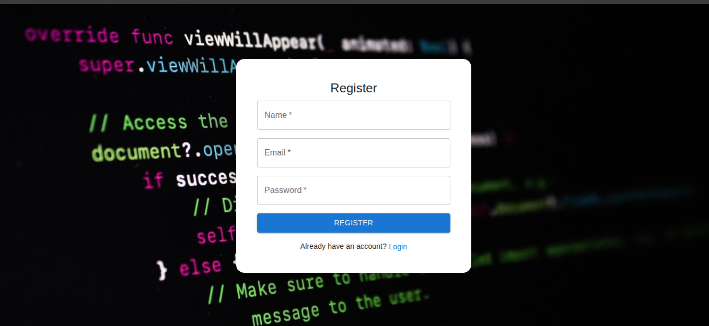
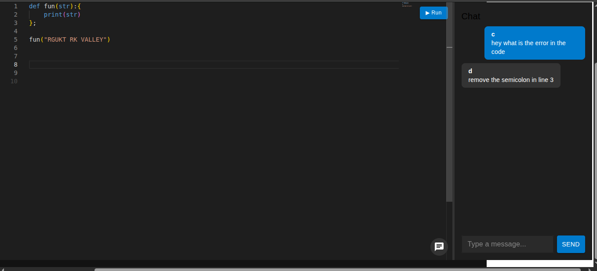
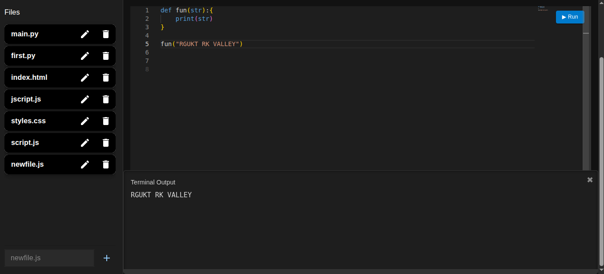
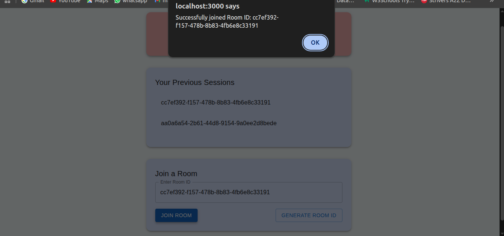
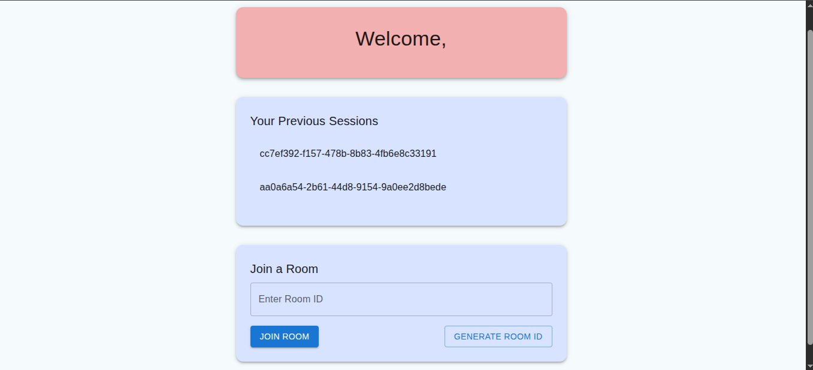

# 🧑‍💻 Collaborative Code Editor

A real-time web-based collaborative code editor designed to support developers, educators, and students who need to write, edit, and communicate code simultaneously across different locations.

> **Built with:** React.js, Node.js, Express.js, Socket.IO, MongoDB, and Monaco Editor

---

## 🚀 Features

- 🧠 Real-time Code Collaboration using WebSockets  
- 📚 Multi-language Syntax Highlighting with Monaco Editor  
- 🗂️ Room-Based Session Management with custom IDs  
- 💬 Integrated Real-Time Chat  
- 📜 Session History & File Storage  
- 🔐 JWT-Based Secure Access  

---

## 🏗️ Tech Stack

| Layer       | Technology                              |
|-------------|------------------------------------------|
| Frontend    | React.js, HTML, CSS, Material UI         |
| Real-time   | Socket.IO                                |
| Backend     | Node.js, Express.js                      |
| Editor      | Monaco Editor                            |
| Database    | MongoDB with Mongoose                    |

---

## 📦 Installation

### 🔧 Backend Setup

```bash
git clone https://github.com/your-username/collaborative-code-editor.git
cd backend
npm install
cp .env.example .env  # Set JWT_SECRET and DB_URI
npm start
```
### 🔧 Frontend Setup

```bash
cd frontend
npm install
npm run dev
```
---

## 🧪 Testing

✔️ **Includes:**

- ✅ Unit tests for authentication and session management  
- ✅ Integration testing of WebSocket events  
- ✅ Real-time multi-user performance test cases  

---

## 📸 Screenshots

### 🔐 Login Page


### 📝 Register Page


### 💬 Chat Window


### 🧑‍💻 Code Editor Interface


### 🚪 Join Notification


### 📊 Session Dashboard

